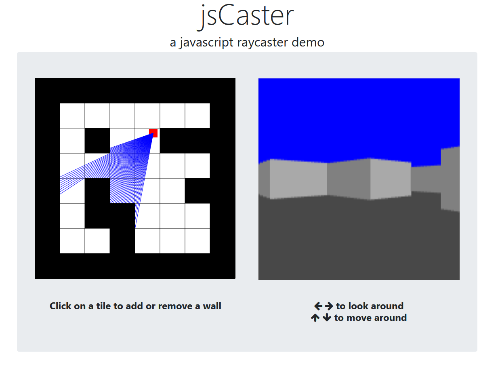

# jsCaster

jsCaster is a JavaScript demo of ray casting. The map can be easily edited using the builtin map editor and the camera moved around. The scene is rendered on every movement or map update.

A live demo can be found here: https://rastkomiocinovic.github.io/jsCaster/
